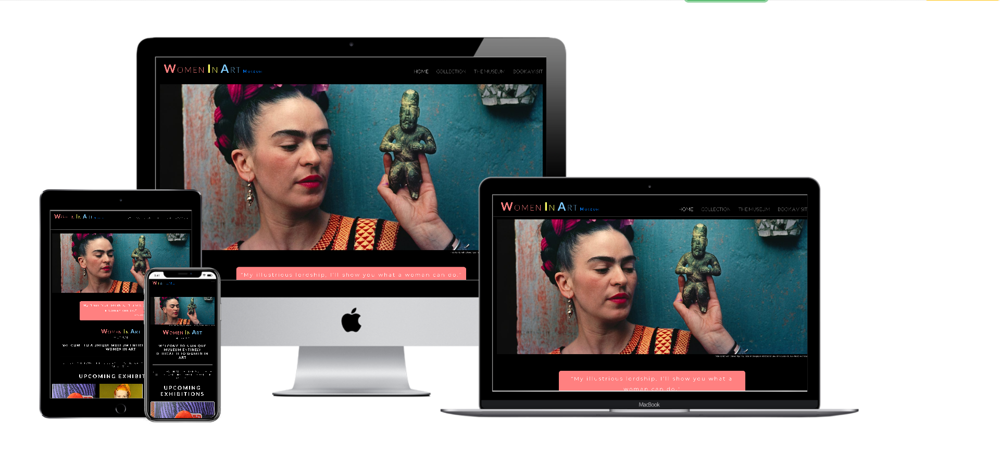
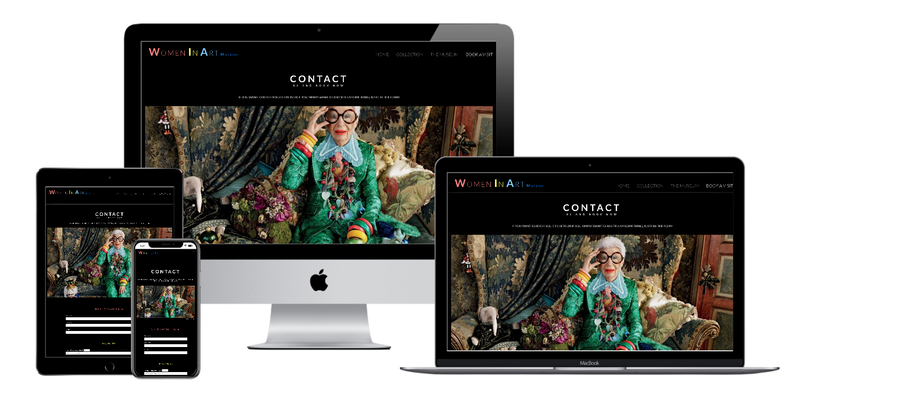

# Women In Art Museum project.

View the live project here. [WIAM](https://marlene32100.github.io/WIAM/)

For the **First Milestone Project** with the **Code Institute**, I have decided to design a static website for a fictional museum dedicated to women in art.

The final user of the website is ideally a millennial person, mostly a woman, who is passionate about art and positive feministic empowerement.
The museum wants to be inclusive as much as it can and make people feel comfortable, so the style will be modern, friendly and strong at the same time.

The website has four pages:

* [Home Page](https://marlene32100.github.io/WIAM/)

Below a sticky header with navbar and menu, there is a hero image with Frida Kahlo, a mexican artist well known as symbol of a independent and revolutionary woman.
I chose the image where she is holding an ancient statue because I thought it gave the idea of a continuum in art through times.

A blockquote welcomes users with a strong citation by baroque painter Artemisia Gentileschi: "My illustrious lordship, I’ll show you what a woman can do."
I think this explains really well what the purpose of the museum is.

A section with three cards shows the upcoming exhibitions. I chose three images of well known female artist with strong personalities, one for a different kind of art.
Yayoi Kusama for visual art, Vivienne Westwood for fashion, Janis Joplin for music.
The colors of the pictures match the style of the website as well, so everything is coherent and armonic.

* [The Collection](https://marlene32100.github.io/WIAM/collection.html)

The second page is about the permanent collection of the museum.

Here I chose to alternate images with a short text, where people can understand that in the museum they will find mostly paintings, both recent and from older times, and photographs.

The images keep the same style as in the Home Page, since they are about female artists with strong personalities.

I chose Tamara de Lempicka, Georgia o'Keefe, Coco Chanel, Marina Abramovic, and again Artemisia Gentileschi and Frida Kahlo.

The Upcoming Exhibitions cards are repeated also in this page.

* [The Museum](https://marlene32100.github.io/WIAM/museum.html)

In this page there is the same layout as in The Collection page. But here we find all those useful informations that a user might need before planning a visit.

Here we find the address, with direct links to Google Maps, a direct link that opens a phone call with the museum, a direct link for email.

Then we find opening hours and prices.

A mention is related to the bistro inside the museum, with a downloadable menu. The user can plan in advance if he/she wants to stay longer also for eating or drinking.

Last, but not least, an important mention to facilities for kids, explaining that they are welcome and that inside the museum there is a special room dedicated to smaller kids, where they can change diapers or where mums can breastfeed.

Upcoming Exhibitions cards are placed also in this page before the footer.

* [Book a Visit](https://marlene32100.github.io/WIAM/book.html)

Here a colorful and funny image of another female icon, Iris Apfel, welcomes users inviting them to fill out the form for bookings or just questions.

The form is structured in three sections: personal data (with required fields), booking (number of tickets and for which exhibition), message (an empty text area where users can write anything they want to say).

After submitting, a message appears which says: "Thank you! Our amazing customer service will contact you soon".

The footer has links to the booking page, but also to social media.

Each icon on the website changes color on hover or when active, so it is more user friendly.

I have tried to keep a very easy navigation style. First of all, the sticky header allows user to navigate on other pages without even scrolling to the top.

For the same reason, the footer has a link to the booking section.

I decided to place this link here because usually when a user scroll down a page, after reading the informations provided in the body and looking at the images, is still excited and more prone to buy the experience.

The Upcoming Exhibitions cards have the same reasoning behind, that is why they have each one a button with a call to action "Book your ticket" and they are also placed at the bottom of the main area of the page.

---
## User Experience (UX)

* [Strategy Plane](UDX/strategy-plane/strategy-plane.pdf)
* [Scope Plane](UDX/scope-plane/scope-plane.pdf)
* [Structure Plane](UDX/structure-plane/structure-plane.pdf)
* [Skeleton Plane](UDX/skeleton-plane/skeleton-plane.pdf)

### User stories

#### First Time Visitor Goals
* As a First Time Visitor, I want to understand what the concept of the museum.
* As a First Time Visitor, I want to find informations about opening hours, address, contact details and other useful infos.
* As a First Time Visitor, I want to check their social medias to understand which kind of experience they usually deliver to guests.
#### Returning Visitor Goals
* As a Returning Visitor, I want to find infos about upcoming exhibitions.
* As a Returning Visitor, I want to book a visit.
#### Frequent User Goals
* As a Frequent User, I want to see if new exhibitions are planned.
* As a Frequent User, I want to have a look at additional facilities I might find on the place, such as the weekly menu of the bistro.

There are links throughout the websites that allow users to get in touch with the museum with just one click. 

In the footer, but also in the Museum page, there are two icons with a direct link for a quick contact: 

A phone icon that opens automatically a window for a phone call, and a mail icon with a mailto link.

### Design

The layout is be simple and modern. Images plays a huge role, since one of the goals of the website is to be visually appealing to get users book a visit to the museum.

As I was working on the code, I suddenly realized that the layout I planned with my wireframe was not so appealing as I thought it would be. I changed it by removing a section and re-placing it with the Upcoming Exhibitions cards.

One issue I had was the navbar brand. I had a specific idea in mind, I wanted that the words "Women in Art" had different colours (the three colours that are the leitmotiv of all the website), but I also wanted that every single word had the first letter capitalized. The only way I found was to wrap each word in a div, and then I styled them. I could have used some graphic program to get a image with the logo, but I wanted to challenge myself a little bit by trying to solve the problem only with CSS.

Responsiveness has been achieved by using a mobile-first approach, adding Bootstrap and then perfectioning with media queries.

The menu icon on smaller screens was not very visible. I decided to make the button a little bit bigger and to change the border color with #fafafa.

### Colour Scheme

A very nice article by Olivier Berni appeared on [Uxdesign.cc](https://uxdesign.cc/the-past-present-and-future-of-dark-mode-9254f2956ec7) helped me understanding deeply the benefits of a dark background.

I have decided to use a black background which leave all the attention to the images and the content.
The first shade of black I  have used was a default #000000, but the testing phase with potential users of the website suggested that a lighter shade of black would have been better.
I changed #000000 with #121212, which is not so strong on the eyes and gives a better reading experience.

I then used a combination of colours (pale red, pale yellow and pale blue) that are repeated throughout the website.

Light gray has been used on icons or as hover effect on links. This colour has also been used on those areas where the background is yellow, because white was not easy at all to read.

The colours used are: 
* #fafafa;
* #ff8080;
* #80ccff;
* #b1afaf;
* #7e7d7d.

At the beginning I have used the color #ff8080 for the button "Book Now" background, but then I realized it was too pale for a call to action. I decided to change it with a red using the Bootstrap property btn-danger.

### Typography

Montserrat and Lato are the fonts used in the website. 

They are both modern and they look really nice especially when adding some space between the letters.
They are easy to read as well.

I have used only in the blockquote the font Jim Nightshade as the font for the signature. It is cursive and it suggests a hand-written signature.

### Imagery

Images are very important, since the website is about a museum.

I have chosen images with strong colours and representing strong personalities, so they suggest the style and the philosphy behind the museum.

### Wireframes

I have started with using Balsamiq, but I realized that my ideas flow much better on paper.
I sketched the pages both for mobile devices and desktop by hand and only after I used Balsamiq to have nice pdfs to share.
The layout on the Home Page goes also on Booking, with the only difference that instead of having text, in the Booking section there is a form.
The Museum Page repeats the same layout in Collection, with of course different content.

[Home Page wireframe](UDX/skeleton-plane/Home.pdf)

[The Collection wireframe](UDX/skeleton-plane/Collection.pdf)

### Features

Responsive on all device sizes.

I played with content hiding a few elements or words on smaller screens, so it looks better and the user doesn't get annoyed.

## Features to implement

In the future I would like to create a better Booking page adding a e-shop where people can buy the tickets and pay them immediately, but also buy merchandise such as books, posters, etc.

It could be nice to add extra pages with videos of the past exhibitions, interviews, and maybe add a page for each upcoming exhibitions where people can find more detailed infos.

I think that a downloadable map of the museum and the area outside could be extremely useful for visitors that actually want to visit the museum. In this way they can plan in advance the tour and also have a map with all the parking places that are close to the museum.

---

## Technologies Used

I have used HTML5, CSS3, Bootstrap4.5.0.

JavaScript with jQuery only for the collapsible navbar.

[Techsini](http://techsini.com/multi-mockup/index.php) as a mockup generator.

### Languages Used

* HTML5
* CSS3

### Frameworks, Libraries & Programs Used

* Bootstrap 4.5.0.
* Google Fonts
* Font Awesome 4.7.0.
* jQuery - as part of Bootstrap to make the navbar collapsible on smaller devices
* Git
* GitHub
* GitPod
* Chrome DevTools
* [Techsini](http://techsini.com/multi-mockup/index.php) mockup generator
* [Autoprefixer CSS](https://autoprefixer.github.io/)

---

## Testing

I have tested with the W3C Markup Validator and W3C CSS Validator Services every time I finished a section, or if I added some changes. 
This helped me to find immediately errors and fix them.

I have tested the website on various screen sizes from mobile phones to large desktop.
Tested also on Google Chrome, Safari, Microsoft Edge, Firefox.

I have used [AmIResponsive?](http://ami.responsivedesign.is/) for a quick preview on multiple devices.

I have asked to relatives and friends to check the website on their own device.
Everyone had a good User Experience, but one thing that was missing in my project and the testing process pointed out, was that usually people expect the navbar brand to be a link that re-directs on the home page.
I then added this feature.
One of the last feedbacks I got before submitting the project, has been a feedback on the gradient of black that I used as a background.
The black I chose was a deep black, but the feedback suggested that a slightly lighter shade of black would have been more sophisticated.
I tried first a #111111 instead of #000000, but then I opted for a #121212 and actually it looked prettier.
I decided to keep this change.

---

## Deployment

### GitHub Pages

The website has been deployed following these steps:
* Log in into GitHub;
* Click on the repository you need to deploy;
* Go on "Settings";
* Scroll down the page until you find the "GitHub Pages" section;
* On "source"click on "none";
* Select "master branch" from the dropdown menu;
* The page will re-load automatically;
* Scroll down again to the same section "GitHub Pages";
* Now you will find a link that says "Your site is published at ..."

### Fork the code 

If you need to work on this code on your own, follow these steps:
* Log in to GitHub;
* Find the repository you are looking for;
* On the top-right of the page you will find a button with the name "Fork";
* Click on it and it will automatically fork the code to your GitHub.

### Local Clone

To make a local clone of the site, just follow these stepsg:

* Log in to your GitHub;
* Under your repository section, select the repo that you need;
* You will find a green button with the name "Code". Click on it;
* On the dropdown selection, you will find a link to clone the code with HHTPS;
* Now open Git bash;
* Open the directory where you want to work on the cloned code;
* Type `git clone` followed by the link you have previously copied.

Done!

---

## Credits

The inspiration for the layout on pages collection.html and museum.html has been taken from the [MoMA](https://www.moma.org/) website.

Images have been taken from the web. Mostly from [Unsplash](https://unsplash.com/).

In the Collection page I have used those pictures (click on the name to visit the source):

* [Tamara de Lempicka](https://www.giacomochiodini.it/wp-content/uploads/2014/01/tamara_de_lempicka_11.jpg);

* [Georgia o'Keeffe](https://www.biography.com/artist/georgia-okeeffe);

* [Coco Chanel](https://www.notizie.it/cultura/2019/08/19/coco-chanel-frasi-biografia/);

* [Marina Abramovic](https://www.animafaarte.it/morto-ulay-il-piu-famoso-ex-della-storia-dellarte-marina-abramovic-e-la-storia-di-un-amore-immaginale/);

* [Artemisia Gentileschi](https://en.wikipedia.org/wiki/Artemisia_Gentileschi);

* [Frida Kahlo](https://www.greenme.it/vivere/arte-e-cultura/faces-of-frida-kahlo-galleria-web/).

The other images all have a figcaption with credits to the author.

The bistro menu pdf has been taken from the [Mandarin Bar & Bistro](https://www.mandarinoriental.it/milan/la-scala/fine-dining/restaurants/italian-cuisine/mandarin-bar-and-bistrot) in Milan.

The [Code Institute](https://github.com/Code-Institute-Solutions/SampleREADME) provided the structure for the README.md file.

The UDX folder and files structure have been provided by my mentor [Spencer Barriball](https://github.com/5pence/monkees-project/tree/master/user-design-experience).

The address used  in the website refers to the [National Museum](https://www.nationalmuseum.se/) in Stockholm.

### Code

The idea for the collapsible navabr comes from the Whiskey Drop project done with the Code Institute, and also the hero image which has been used in the Love Running project.
I thought these two elements were really nice and user friendly. 

The idea for the layout in the pages collection.html and museum.html comes from the MoMA website.

[Bootstrap](https://getbootstrap.com/) has been used to make the website responsive, but also with the code for the collapsible menu, the cards, buttons and some styling. However, I have tried to customize also Bootstrap to make the website more mine.

The choice of colour for the dark background in the form has been helped with [Color-Hex.com](https://www.color-hex.com/color/121212).

I have then used [TheW3School](https://www.w3schools.com/) website and the book ["Learning Web Design"](https://www.amazon.com/Learning-Web-Design-Beginners-JavaScript-ebook/dp/B07DQ5RZJV) by Jennifer Robbins whenever I had doubts with the proper semantics.

[Autoprefixer CSS](https://autoprefixer.github.io/) helped me with CSS vendor.

### Media

I took the pictures from [Unsplash](https://unsplash.com/), but also from various websites. I have added a figcaption for those pictures that have copyrights.

### Acknowledgements

My Mentor Spencer Barriball for his feedback and precious help.