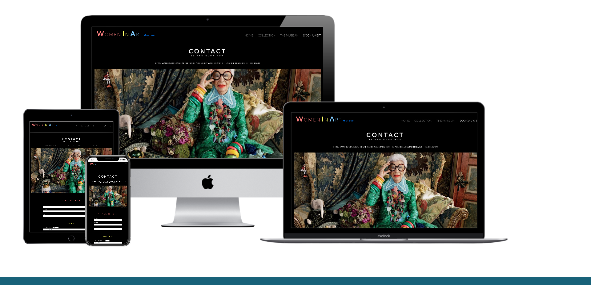

# Women In Art Museum project.

View the live project here. [WIAM](https://marlene32100.github.io/WIAM/)

For the **First Milestone Project** with the **Code Institute**, I have decided to design a static website for a fictional museum dedicated to women in art.

The final user of the website is ideally a millennial person, mostly a woman, who is passionate about art and positive feministic empowerement.
The museum wants to be inclusive as much as it can and make people feel comfortable, so the style will be modern, friendly and strong at the same time.

---
## User Experience (UX)

### User stories

#### First Time Visitor Goals
* As a First Time Visitor, I want to understand what the concept of the museum.
* As a First Time Visitor, I want to find informations about opening hours, address, contact details and other useful infos.
* As a First Time Visitor, I want to check their social medias to understand which kind of experience they usually deliver to guests.
#### Returning Visitor Goals
* As a Returning Visitor, I want to find infos about upcoming exhibitions.
* As a Returning Visitor, I want to book a visit.
#### Frequent User Goals
* As a Frequent User, I want to see if new exhibitions are planned.
* As a Frequent User, I want to have a look at additional facilities I might find on the place, such as the weekly menu of the bistro.

### Design

The layout will be simple and modern. Images will play a huge role, since one of the goals of the website is to be visually appealing to get users book a visit to the museum.

#### Colour Scheme

I have decided to use a black background and a combination of colours that are repeated throughout the website.

The colours used are: 
* #fafafa;
* #ff8080;
* #80ccff;
* #b1afaf;
* #7e7d7d.

At the beginning I have used the color #ff8080 for the button "Book Now" background, but then I realized it was too pale for a call to action. I decided to change it with a red using the Bootstrap property btn-danger.

### Typography

Montserrat and Lato are the fonts used in the website. 

They are both modern and they look really nice especially when adding some space between the letters.
They are easy to read as well.

I have used only in the blockquote the font Jim Nightshade as the font for the signature. It is cursive and it suggests a hand-written signature.

### Imagery

Images are very important, since the website is about a museum.

I have chosen images with strong colours and representing strong personalities, so they suggest the style and the philosphy behind the museum.

### Wireframes

I have started with using Balsamiq, but I realized that my ideas flow much better on paper.
I sketched the pages both for mobile devices and desktop.

### Features
Responsive on all device sizes.

I played with content hiding a few elements or words on smaller screens, so it looks better and the user doesn't get annoyed.

---

## Technologies Used
I have used HTML5, CSS3, Bootstrap4.5.0.

JavaScript with jQuery only for the collapsible navbar.

[Techsini](http://techsini.com/multi-mockup/index.php) as a mockup generator.

### Languages Used
* HTML5
* CSS3

### Frameworks, Libraries & Programs Used
* Bootstrap 4.5.0.
* Google Fonts
* Font Awesome
* jQuery - as part of Bootstrap to make the navbar collapsible on smaller devices.
* Git
* GitHub
* GitPod
* Chrome DevTools

---

## Testing
I have tested with the W3C Markup Validator and W3C CSS Validator Services.

I have tested the website on various screen sizes from mobile phones to large desktop.
Tested also on Google Chrome, Safari, Microsoft Edge, Firefox.

I have asked to relatives and friends to check the website on their own devices. Everyone had a good User Experience.

---

## Deployment

### GitHub Pages

The website has been deployed following these steps:
* Log in into GitHub;
* Click on the repository you need to deploy;
* Go on "Settings";
* Scroll down the page until you find the "GitHub Pages" section;
* On "source"click on "none";
* Select "master branch" from the dropdown menu;
* The page will re-load automatically;
* Scroll down again to the same section "GitHub Pages";
* Now you will find a link that says "Your site is published at ..."

### Fork the code 

If you need to work on this code on your own, follow these steps:
* Log in to GitHub;
* Find the repository you are looking for;
* On the top-right of the page you will find a button with the name "Fork";
* Click on it and it will automatically fork the code to your GitHub.

### Local Clone

To make a local clone of the site, just follow these steps after forking the code:

* Log in to your GitHub;
* Under your repository section, select the repo that you need;
* You will find a green button with the name "Code". Click on it;
* On the dropdown selection, you will find a link to clone the code with HHTPS;
* Now open Git bash;
* Open the directory where you want to work on the cloned code;
* Type `git clone` followed by the link you have previously copied.

Done!

---

## Credits

The inspiration for the layout on pages collection.html and museum.html has been taken from the [MoMA](https://www.moma.org/) website.

Images have been taken from the web. Mostly from [Unsplash](https://unsplash.com/). The other images all have a figcaption with credits to the author.

The bistro menu pdf has been taken from the [Mandarin Bar & Bistro](https://www.mandarinoriental.it/milan/la-scala/fine-dining/restaurants/italian-cuisine/mandarin-bar-and-bistrot) in Milan.

The [Code Institute](https://github.com/Code-Institute-Solutions/SampleREADME) provided the structure for the README.md file.

The UDX folder and files structure have been provided by my mentor [Spencer Barriball](https://github.com/5pence/monkees-project/tree/master/user-design-experience).

### Code

The collapsible navabr idea comes from the Whiskey Drop project done with the Code Institute, and also the hero image which has been used in the Love Running project.
I thought these two elements were really nice and user friendly.

The idea for the layout in the pages collection.html and museum.html comes from the MoMA website.

Bootstrap4 has been used to make the website responsive.

I have then used [TheW3School](https://www.w3schools.com/) website and the book "Learning Web Design" by Jennifer Robbins whenever I had doubts with the proper semantics.

### Media

I took the pictures from [Unsplash](https://unsplash.com/), but also from various websites. I have added a figcaption for those pictures that have copyrights.

### Acknowledgements
My Mentor Spencer Barriball for his feedback and precious help.